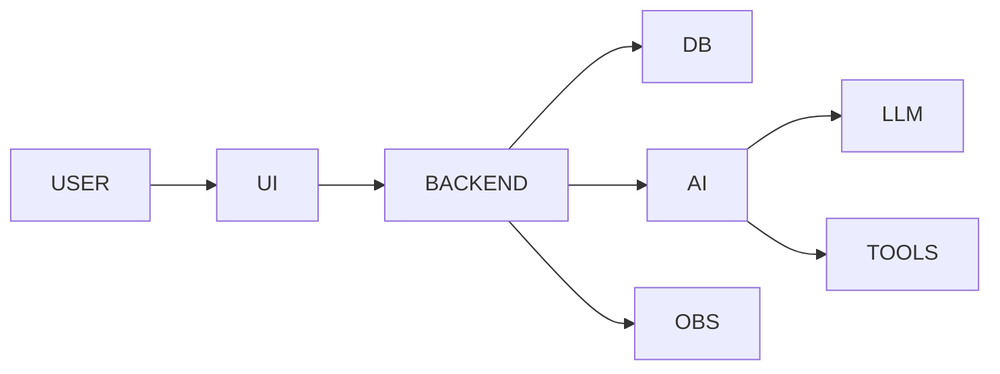

<p align="center">
  
</p>

<p align="center">
  
</p>

<p align="center">
  
</p>

---

# 🚀 MULTI-ROLE ENGINEER DASHBOARD

```diff
+ PROFILE: Luis Felipe Zúñiga Calderón
+ ROLES: Full Stack | Product Owner | AI Agent Engineer
+ FOCUS: AI + PRODUCT + SCALABLE SYSTEMS
+ MODE: BUILDING HIGH-IMPACT SOLUTIONS
```

---

## 🧠 CORE SYSTEMS

<div align="center">

| AREA              | STATUS   | DESCRIPTION                              |
|------------------|----------|------------------------------------------|
| 💻 Full Stack     | 🟢 Active | Web apps (.NET, Python, JS)              |
| 🤖 AI Agents      | 🟢 Active | LLM + tools + automation                 |
| 📦 Product Owner  | 🔵 Running| Requirements, backlog, value delivery    |
| 📊 Data           | 🟡 Active | SQL, MongoDB, analytics                  |
| 📡 Observability  | 🟣 Advanced | Monitoring & metrics                   |

</div>

---

## 🧬 SYSTEM ARCHITECTURE



---

## 📊 GITHUB METRICS

<p align="center">
  
  
</p>

<p align="center">
  
</p>

---

## 🧠 WHAT I DO

- Build full stack applications
- Design AI agents with LLMs
- Define product strategy and backlog
- Automate business workflows
- Monitor systems and performance

---

🚀 TECH STACK 
🤖 AI / LLMs
<p align="center">  </p> <p align="center">     </p>
💻 Full Stack
<p align="center">  </p>
🗄️ Data & Databases
<p align="center">  </p>
⚙️ DevOps & Infra
<p align="center">  </p>
📡 Observability
<p align="center">    </p>
📦 Product Owner
<p align="center">    </p>

## ⚡ SYSTEM STATUS

```bash
FULLSTACK: ACTIVE
AI_AGENTS: ACTIVE
PRODUCT: RUNNING
SYSTEMS: STABLE
```

---

## 🐍 CONTRIBUTIONS

<p align="center">
  
</p>

<p align="center">
  
  
</p>

## 🌐 CONNECT
<p align="center"> <a href="https://github.com/LuisZucalDev">  </a> <a href="https://www.linkedin.com/in/luisfelipezucal">  </a> </p> 

